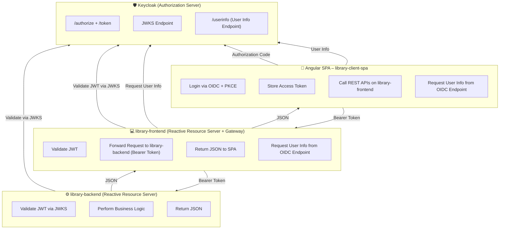

# Angular SPA Library Client - Example OAuth2 Authorization Code Flow

This is a simple example of an Angular SPA that uses the OAuth2 Authorization Code Flow with PKCE to authenticate with a Keycloak server.

## Architecture / Flow Diagram

